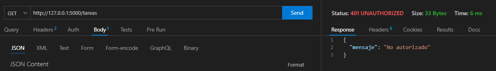

# Progración sobre redes. IFTS 29. 
# PFO 2: Sistema de Gestión de Tareas con API y Base de Datos 

- **Alumno**: López, Luciano
- **DNI**: 34211309

## Instrucciones para ejecutar el proyecto

### Servidor

1. Crear una carpeta nueva y abrirla desde VSC

2. Clonar el repositorio (desde la terminal de VSC):  
  git clone https://github.com/lucianolop88/pfo2_redes  
  cd pfo2_redes

3. Instalar dependencias (terminal):  
  pip install -r requirements.txt

4. Ejecutar el servidor:  
  python servidor.py

El servidor quedará iniciado en http://127.0.0.1:5000

### Cliente

1. Iniciar el servidor siguiendo los pasos del punto anterior

2. Abrir una segunda terminal en VSC

3. Ejecutar el cliente:  
  python cliente.py

Se mostrará un menú en dicha terminal donde se podra registrarse, iniciar sesión, ver las tareas y salir.

También se puede probar el proyecto usando Thunder Cliente:

- Para registrar un usuario, hacer una petición POST a:  
  http://127.0.0.1:5000/registro  
  En el body, enviar con formato JSON, usuario y contraseña.  

- Para iniciar sesión, hacer una petición POST a:  
  http://127.0.0.1:5000/login  
  En el body, enviar con formato JSON, usuario y contraseña.  

- Para acceder a las tareas, hacer una petición GET a:  
  http://127.0.0.1:5000/tareas

## Preguntas Conceptuales

### ¿Por qué hashear contraseñas?
Para que, en caso de que se acceda a la base de datos, las contraseñas no puedan ser utilizadas. Hashear agrega una capa de seguridad al almacenar versiones encriptadas de la contraseña original.

### Ventajas de SQLite en este proyecto
- No necesita configuración de servidor.
- Ligero, portable y embebido en la aplicación.

## Capturas

### CLI

#### Registro

Exitoso 

Duplicado

#### Login

Exitoso

Credenciales incorrectas

#### Tareas

Exitoso

No autorizado

### Thunder Client

#### Registro

Exitoso

Duplicado

#### Login

Exitoso

Credenciales incorrectas

#### Tareas

Exitoso

No autorizado

